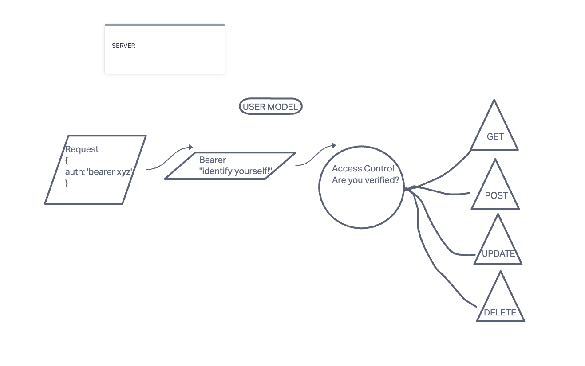

# Authentication Server Phase 3: Access Control

## auth-api
### lab 08

### Author: Michael Campbell

#### Description: 
- This application implements Role Based Access Control (RBAC) using an Access Control List (ACL), allowing to not only restrict access to routes for valid users, but also based on the individual permissions we give each user. 

#### Links:
[Heroku](https://mc-auth-api-server.herokuapp.com/)

[repo](https://github.com/MichaelCampbell-on3001/auth-api)

#### Pull Request
[Basic Auth Pull Request](https://github.com/MichaelCampbell-on3001/auth-api/pull/1)

#### USED SQLite

### Setup
**Dependencies:**
- dotenv
- express
- jest
- nodemon
- supertest
- sequelize
- sequelizeCLI
- sqlite3
- base64
- bCrypt

#### Running the app
- npm start
- Endpoint/ error status
      - Return error message

#### Tests
- Server Test `npm run test`

#### UML

created with [invisionApp](https://invisionapp.com/)

